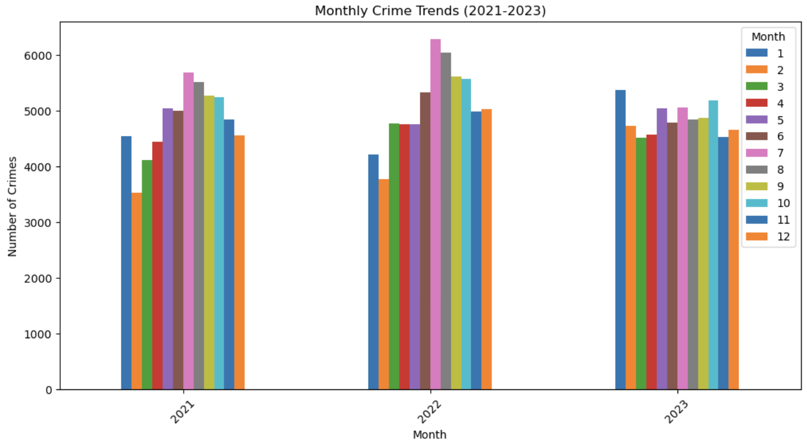
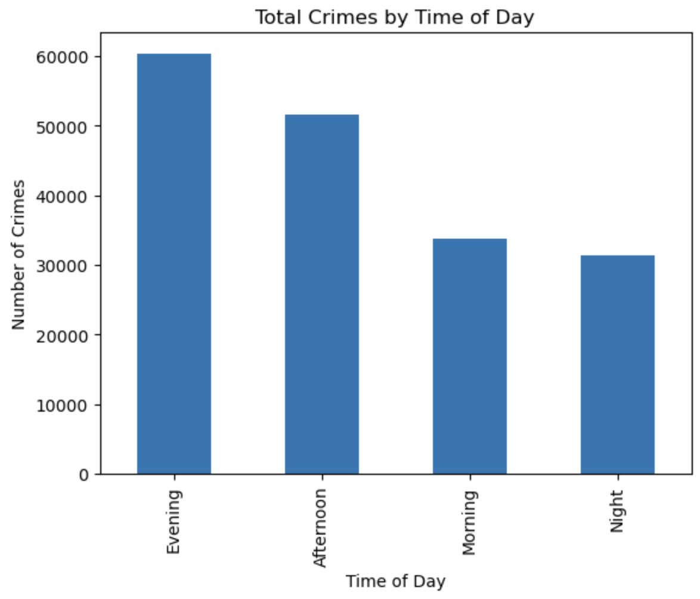
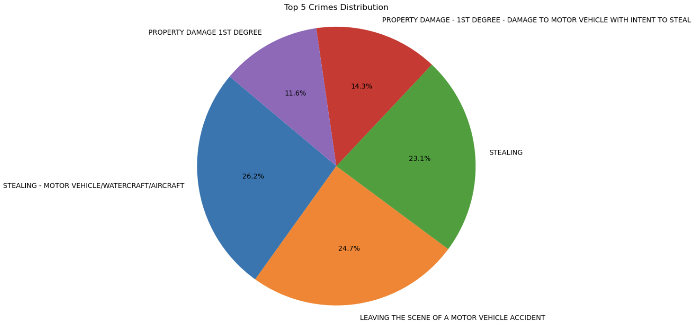

# St. Louis, MO Crime Trends Analysis (2021-2023)

This project uses Exploratory Data Analysis (EDA) to examine the top five crime trends in St. Louis, Missouri, from 2021 to 2023. We chose to focus on St. Louis due to its designation as the city with the highest crime rates in the United States, making its dataset particularly rich and insightful for analysis. The goal of this project is to analyze how crime has evolved over this period and answer key questions about its patterns. Specifically, the project will explore whether crime has increased or decreased, how it varies by season, and how different types of crime have changed over time. Additionally, the analysis will investigate if crime trends differ by time of day and identify the time of year with the least amount of crime. By examining these factors, the project aims to provide a clearer understanding of crime trends in St. Louis and reveal where and when crime is most concentrated throughout the year.

Understanding crime trends is crucial for developing effective public safety strategies and policies, not only for St. Louis but for other cities as well. While St. Louis provides a particularly rich dataset, the methods and insights derived from this research can be applied to other cities facing similar challenges. By identifying patterns in crime by time of day, season, and type, cities can optimize resource allocation and focus public safety initiatives during peak crime periods. If certain seasons, like winter or summer, see higher crime rates, targeted prevention measures can be put in place. Additionally, understanding how crime trends evolve over time can help cities forecast and mitigate future crime spikes more effectively.

This research empowers authorities in cities of all sizes to take proactive steps in improving safety and quality of life, leveraging the lessons learned from St. Louis' experience.

Picture sourced from [Fodor's Travel](https://www.fodors.com/)

## Table of Contents:

1. [Key Questions](#key-questions)
2. [Project Objectives](#project-objectives)
3. [Research Approach](#research-approach)
4. [Datasets](#datasets)
5. [Tools and Libraries](#tools-and-libraries)
6. [Analysis and Conclusion](#analysis-and-conclusion)
7. [Next Steps](#next-steps)

### Key Questions:

1. **Has crime decreased or increased in St. Louis from 2021 to 2023?**
2. **Does crime peak by season of the year (winter, spring, summer, fall)?**
3. **How have different types of crime (e.g., violent, property, drug-related) increased or decreased?**
4. **Do crimes trend a certain way compared to the time of day?**
5. **What time of year has the least amount of crime?**

## Project Objectives

### 1. **Data Collection & Cleaning**

- Compile and preprocess datasets that include crime records (type, location, time) and seasonal data for St. Louis.
- Ensure data consistency and accuracy for effective analysis.

### 2. **Exploratory Data Analysis (EDA)**

- Summarize key characteristics of crime data to identify overall trends.
- Use visualizations and correlation analysis to uncover relationships between crime rates and seasonal factors.
- Investigate how different types of crime have evolved over time.

### 3. **Time and Seasonal Analysis**

- Examine fluctuations in crime rates across different times of the day, days of the week, and seasons of the year.
- Identify any seasonal or temporal patterns in crime incidents, such as spikes in specific months or times.

### 4. **Crime Type Analysis**

- Analyze how specific types of crime have increased or decreased over the period.
- Identify if certain crimes tend to peak during specific seasons or times of day.

## Research Approach

A **descriptive analysis method** was used, involving the summarization of raw data to provide basic insights, such as averages, counts, and trends. This approach helps answer 'what happened' questions by examining the overall patterns and changes in crime over time.

## Datasets

### 1. **St. Louis Crime Data**

- **Description**: Records of reported crimes in St. Louis from 2021 to 2023 are included in this dataset, featuring details such as crime type, location, date, and time. It provides a comprehensive overview of crime trends across the city. Focus was placed on data fields reflecting the types of crimes, times of day crimes were committed, monthly crime rates, seasonal crime trends, and yearly data values, enabling a thorough exploration of how crime patterns have evolved over time.

- **Source**: [St. Louis Metropolitan Police Department](https://slmpd.org/stats/)

## Tools and Libraries

The following tools and libraries were used for analysis and development:

- **Python**: Programming language for data processing, analysis, and visualization.
- **Pandas**: Data manipulation and analysis.
- **NumPy**: Numerical computing and data manipulation.
- **Matplotlib**: Data visualization libraries for creating plots and charts.
- **Jupyter Notebooks**: For documenting and sharing the analysis process interactively.
- **Visual Studio Code**: Development environment used for coding, debugging, and project management.

## Analysis and Conclusion

The analysis of crime trends in St. Louis from 2021 to 2023 reveals several key findings that can inform law enforcement and city planning strategies for improving public safety.
<<<<<<< HEAD
=======

1. **Overall Crime Trends**:  
   The year 2022 saw the highest number of crimes, indicating an upward trend in criminal activity over the period studied. This suggests that crime in St. Louis peaked in the second year of the study, though further investigation into specific crime types and seasonal factors may provide additional insights.

2. **Seasonal Crime Patterns**:  
   Crime rates were consistently highest during the summer months, with July emerging as the peak month for both 2021 and 2022. However, 2023 experienced a notable shift, with January reporting the highest crime rates for that year. This seasonal variation underscores the importance of targeted interventions during the summer months while also considering potential seasonal shifts in crime patterns, such as those observed in early 2023.

3. **Time of Day and Crime Type**:  
   Analysis of the time of day when crimes were committed showed that evenings, particularly between 6 PM and 9 PM, had the highest crime occurrence across the five crime types studied. This highlights the need for increased law enforcement presence during these peak hours. Conversely, the fewest crimes were committed at night, suggesting that crime activity tends to subside after late evening.

4. **Most Common Crimes**:  
   Car theft emerged as the most frequent crime type, suggesting a targeted area for prevention efforts. Property damage (1st Degree), on the other hand, occurred less frequently than other crime types, indicating that property damage may not be as widespread as other criminal activities.

5. **Winter Crime Trends**:  
   The winter months, particularly December through February, saw the fewest crime incidents across all types, which may reflect lower overall activity due to colder weather conditions. However, this should be carefully considered when planning resource allocation, as it does not necessarily imply the absence of criminal behavior, just a reduction in volume.

### Conclusion
The findings from this analysis provide critical insights into the patterns and distribution of crime in St. Louis. By understanding when and where crimes are most likely to occur—whether in summer months, evening hours, or specific crime types like car theft—city officials and law enforcement can better allocate resources to where they are most needed. Additionally, while seasonal trends suggest lower crime in winter, the peak months in the summer, especially July, should be a focus for preventative measures.

These insights offer a foundation for further predictive modeling, resource optimization, and policy recommendations aimed at reducing crime and improving public safety in St. Louis and similar cities.

## Next Steps
>>>>>>> fc3ebf2 (Updated Analysis and Conclusion section of README.md)

1. **Overall Crime Trends**:  
   The year 2022 saw the highest number of crimes, indicating an upward trend in criminal activity over the period studied. This suggests that crime in St. Louis peaked in the second year of the study, though further investigation into specific crime types and seasonal factors may provide additional insights.

   

2. **Summer Crime Trends**:  
   Crime rates were consistently highest during the summer months, with July emerging as the peak month for both 2021 and 2022. However, 2023 experienced a notable shift, with January reporting the highest crime rates for that year. This seasonal variation underscores the importance of targeted interventions during the summer months while also considering potential seasonal shifts in crime patterns, such as those observed in early 2023.
   

   

3. **Winter Crime Trends**:  
   The winter months, particularly December through February, saw the fewest crime incidents across all types, which may reflect lower overall activity due to colder weather conditions. However, this should be carefully considered when planning resource allocation, as it does not necessarily imply the absence of criminal behavior, just a reduction in volume.

   

4. **Time of Day and Crime Type**:  
   Analysis of the time of day when crimes were committed showed that evenings, particularly between 6 PM and 9 PM, had the highest crime occurrence across the five crime types studied. This highlights the need for increased law enforcement presence during these peak hours. Conversely, the fewest crimes were committed at night, suggesting that crime activity tends to subside after late evening.

   

5. **Most Common Crimes**:  
   Car theft emerged as the most frequent crime type, suggesting a targeted area for prevention efforts. Property damage (1st Degree), on the other hand, occurred less frequently than other crime types, indicating that property damage may not be as widespread as other criminal activities.

   

   
### Conclusion
The findings from this analysis provide critical insights into the patterns and distribution of crime in St. Louis. By understanding when and where crimes are most likely to occur—whether in summer months, evening hours, or specific crime types like car theft—city officials and law enforcement can better allocate resources to where they are most needed. Additionally, while seasonal trends suggest lower crime in winter, the peak months in the summer, especially July, should be a focus for preventative measures.

These insights offer a foundation for further predictive modeling, resource optimization, and policy recommendations aimed at reducing crime and improving public safety in St. Louis and similar cities.

### Next Steps

Building on the insights gained from the analysis of crime trends in St. Louis from 2021 to 2023, several next steps can be pursued to further enhance public safety strategies and improve the effectiveness of crime prevention efforts. These steps aim to address both immediate concerns and long-term goals, with a focus on predictive analytics, targeted interventions, and resource optimization.

1. **Predictive Modeling for Crime Forecasting**  
   Develop and test predictive models using machine learning techniques to forecast future crime trends based on historical data. These models can identify high-risk areas and times of day for specific crime types, enabling law enforcement to proactively allocate resources and plan interventions. Key features like time of day, seasonality, and specific crime types should be incorporated into the models to improve accuracy and granularity.

2. **Real-Time Crime Monitoring and Response Systems**  
   Implement or enhance real-time crime monitoring systems that leverage predictive analytics to identify emerging hotspots. By combining historical crime data with live crime reports, authorities can adjust patrol patterns and resource deployment in real-time to respond to changing crime dynamics. This approach could reduce response times and improve public safety outcomes.

3. **Seasonal Crime Prevention Strategies**  
   Given the seasonal trends observed, particularly the spikes in crime during the summer months and in January 2023, it is crucial to tailor prevention efforts to the times and seasons when crime is most prevalent. In the summer, efforts could include increased patrols, community engagement programs, and targeted surveillance in areas with high concentrations of car thefts and property crimes. In winter, while crime activity is generally lower, authorities could focus on addressing specific seasonal concerns such as domestic violence or alcohol-related offenses.

4. **Community Engagement and Education Programs**  
   Engage with local communities to raise awareness of crime prevention measures. Educational programs can focus on teaching citizens about crime risks during peak times (e.g., evenings and summer months) and preventive steps they can take to protect their property, such as anti-theft measures for vehicles. Collaborative efforts between law enforcement and community organizations can also build trust and improve public safety by empowering local residents to participate in crime reduction initiatives.

5. **Weather-Driven Crime Analysis**  
   Investigate how weather patterns (e.g., temperature, precipitation) influence crime rates. This could reveal important trends, such as whether crimes increase during certain weather conditions (e.g., warmer temperatures in summer or cold, snowy days in winter). Understanding these correlations can help law enforcement prepare for seasonal crime fluctuations and adjust strategies accordingly.

6. **Targeted Policing for High-Risk Crime Types**  
   Focus efforts on the most prevalent crime types, particularly car thefts, which were the most common crime in the analysis. Strategies could include vehicle anti-theft awareness campaigns, the installation of security cameras in high-risk areas, and the use of technology like GPS tracking to recover stolen vehicles more quickly. Collaboration with auto manufacturers to enhance vehicle security features could also be explored.

7. **Policy Development and Resource Allocation**  
   Using the insights from this analysis, develop data-driven policy recommendations for city planners, law enforcement, and policymakers. These recommendations should focus on optimizing resource allocation, ensuring that areas and times with the highest crime rates receive adequate attention. Additionally, policies could be created to address seasonal crime trends, such as offering support for residents during peak months and ensuring public safety infrastructure is adequately staffed.

8. **Long-Term Study and Evaluation**  
   Conduct a long-term study (e.g., 5-10 years) to track changes in crime trends beyond 2023. This ongoing evaluation could help identify emerging patterns, refine predictive models, and assess the effectiveness of interventions and policies over time. By regularly updating and analyzing crime data, St. Louis can stay ahead of evolving trends and continue improving public safety measures.

9. **Collaboration with Other Cities**  
   Given the broader implications of these findings, explore opportunities for collaboration with other cities facing similar crime challenges. Sharing insights and strategies across cities could lead to more comprehensive crime reduction programs and best practices. Collaborative networks could also facilitate joint research initiatives focused on crime prevention and community safety.
   
  ***
  
## License

This project is licensed under the **MIT License** - see the [LICENSE](LICENSE) file for details.
